		

**UNIVERSIDAD PRIVADA DE TACNA**

**FACULTAD DE INGENIERÍA**

**Escuela Profesional de Ingeniería de Sistemas**

` `**Proyecto “Casa de Cambio en Línea”**

Curso: Calidad y Pruebas de Software

Docente: Ing Patrick Jose Cuadros Quiroga

Integrantes:

***Chambi Cori, Jerson Roni			(2021072619)***

***Flores Quispe, Jaime Elias			(2021070309)***

***Leyva Sardon, Elvis Ronald		(2021072614)***

**Tacna – Perú**

***2024***

**Sistema “Casa de Cambio en Línea”**

**Informe de Análisis**

**Versión *{1.0}***

|CONTROL DE VERSIONES||||||
| :-: | :- | :- | :- | :- | :- |
|Versión|Hecha por|Revisada por|Aprobada por|Fecha|Motivo|
|1\.0|MPV|ELV|ARV|03/10/2024|Versión Original|

**ÍNDICE GENERAL**

[**1. Antecedentes o introducción	4**](#_30j0zll)**

[**2. Título	5**](#_3znysh7)

[**3. Autores	5**](#_tyjcwt)

[**4. Planteamiento del problema	5**](#_2s8eyo1)

[**4.1 Problema	5**](#_17dp8vu)

[**4.2 Justificación	6**](#_3rdcrjn)

[**4.3 Alcance	6**](#_26in1rg)

[**5. Objetivos	7**](#_lnxbz9)

[**5.1 Objetivo general	7**](#_35nkun2)

[**5.2 Objetivos Específicos	8**](#_1ksv4uv)

[**6. Referentes teóricos	8**](#_44sinio)

[**7. Desarrollo de la propuesta	12**](#_3o7alnk)

[**7.1 Tecnología de información	13**](#_23ckvvd)

[**7.2 Metodología, técnicas usadas	13**](#_ihv636)

[**8. Cronograma	31**](#_1ljsd9k)

[**9. Conclusión	33**](#_45jfvxd)

**Informe de Factibilidad**
1. # **Antecedentes o introducción**
   El proyecto de una Casa de Cambio en Línea surge como respuesta a la creciente demanda de servicios financieros digitales y la necesidad de facilitar el intercambio de divisas de manera segura y eficiente en el entorno digital. Anteriormente, diversas plataformas han incursionado en este ámbito, ofreciendo soluciones que permiten a los usuarios realizar transacciones de divisas desde la comodidad de sus dispositivos electrónicos. Estos antecedentes han demostrado la viabilidad y el potencial de mercado para este tipo de servicios, al mismo tiempo que han destacado la importancia de contar con sistemas robustos de seguridad y cumplimiento normativo para proteger tanto a los usuarios como a la propia plataforma.

   Además, la evolución tecnológica ha jugado un papel crucial en el desarrollo de este proyecto, permitiendo la integración de herramientas avanzadas como inteligencia artificial y blockchain para mejorar la transparencia, la velocidad y la confianza en las transacciones. Iniciativas anteriores han explorado estas tecnologías emergentes para optimizar la experiencia del usuario y garantizar la trazabilidad de cada operación realizada en la plataforma de Casa de Cambio en Línea. Estos avances han sentado las bases para un servicio más eficiente y adaptado a las necesidades cambiantes del mercado globalizado.

   Por otro lado, la experiencia acumulada por empresas y startups en el sector de fintech ha proporcionado lecciones valiosas sobre la gestión de riesgos, la escalabilidad y la expansión internacional de servicios financieros en línea. Antecedentes de proyectos similares han enfrentado desafíos significativos como la regulación transfronteriza, la ciberseguridad y la interoperabilidad con sistemas financieros existentes. Estos aprendizajes han sido cruciales para diseñar estrategias efectivas que permitan al proyecto de Casa de Cambio en Línea no solo crecer de manera sostenible, sino también establecerse como una opción confiable y competitiva en el mercado global de intercambio de divisas digital.
1. # **Título**
   “Casa de Cambio en Línea”
1. # **Autores**
   JAIME FLORES QUISPE

   JERSON CHAMBI CORI

   ELVIS LEYVA SARDON
1. # **Planteamiento del problema**

En el contexto de Casa de Cambio en Línea se ve influido significativamente por la reglamentación vigente en cada país. En muchos casos, las regulaciones imponen límites estrictos sobre el monto máximo que los ciudadanos pueden cambiar, ya sea en efectivo o a través de plataformas electrónicas. Por ejemplo, en el Perú, la Superintendencia de Banca, Seguros y AFP (SBS) establece límites específicos para las conversiones a dinero electrónico acumuladas por un mismo titular en un mes. Estos límites, aunque buscan regular y controlar las operaciones financieras, pueden representar una barrera para los usuarios que requieren cambiar cantidades mayores o realizar transacciones frecuentes de divisas en línea.

Además, en el ámbito del cambio de divisas en línea, los usuarios se enfrentan a desafíos adicionales. Uno de los principales problemas es la dificultad para acceder a tasas de cambio competitivas y actualizadas. La fluctuación constante en los mercados de divisas puede resultar en diferencias significativas entre las tarifas ofrecidas por distintas plataformas, lo que puede afectar la rentabilidad de las transacciones. La falta de transparencia en la determinación de estas tasas y en los costos asociados también contribuye a la complejidad y a la incertidumbre para los usuarios.

Otro aspecto crítico es la seguridad de las transacciones. Los usuarios están cada vez más preocupados por la protección de sus datos personales y financieros al realizar operaciones en línea. La falta de estándares claros y de tecnologías avanzadas de seguridad puede generar desconfianza y desmotivar a los usuarios a utilizar servicios de cambio de divisas en línea. En consecuencia, la experiencia del usuario puede verse afectada negativamente, reduciendo su satisfacción y limitando el potencial de crecimiento del mercado de este tipo de servicios.
1. ## ` `**Problema**
El proyecto de Casa de Cambio en Línea enfrenta problemas específicos relacionados con la funcionalidad y la usabilidad de la plataforma misma. Uno de los problemas más prominentes es la falta de una plataforma integral que permita a los usuarios cotizar, convertir divisas, gestionar sus cuentas de manera efectiva y segura, y acceder a un historial detallado de sus transacciones. La ausencia de estas funcionalidades puede limitar severamente la capacidad de la plataforma para satisfacer las necesidades y expectativas de los usuarios modernos.

En primer lugar, la falta de una herramienta de cotización clara y precisa puede frustrar a los usuarios al no poder obtener información inmediata y actualizada sobre las tasas de cambio vigentes. Esto no solo afecta la transparencia del servicio, sino que también podría llevar a los usuarios a buscar opciones más accesibles y convenientes en otros lugares.

Asimismo, la incapacidad de los usuarios para convertir divisas de manera eficiente y segura en la misma plataforma puede resultar en una experiencia fragmentada y poco intuitiva. La falta de una interfaz robusta para realizar estas conversiones podría generar confusión y complicar el proceso de transacción, lo que a su vez impactaría negativamente en la satisfacción del usuario y en la adopción del servicio.

Además, la gestión de cuentas y la visualización de historiales de transacciones son aspectos críticos para la experiencia del usuario en cualquier plataforma financiera en línea. La ausencia de herramientas claras para administrar y monitorear las actividades financieras puede dificultar la fidelización de los clientes y afectar la percepción general de la plataforma como un servicio confiable y eficiente.

Finalmente, la falta de una opción clara para cerrar sesión de manera segura podría plantear riesgos de seguridad y privacidad para los usuarios, quienes esperan tener control completo sobre su información personal y financiera. Sin una función adecuada para cerrar sesión, la plataforma podría exponer a los usuarios a riesgos innecesarios, comprometiendo así la confianza en el servicio y la reputación de la empresa en el mercado.
1. ## ` `**Justificación**
La justificación del proyecto de Casa de Cambio en Línea se fundamenta en la creciente demanda global por servicios financieros más accesibles, rápidos y seguros. En un mundo cada vez más digitalizado, los usuarios buscan alternativas que les permitan realizar operaciones de cambio de divisas desde la comodidad de sus dispositivos móviles o computadoras. Esta tendencia hacia la digitalización de servicios financieros es evidente en el aumento del comercio electrónico internacional, la expansión de negocios globales y la necesidad de individuos y empresas de gestionar activos en diferentes monedas de manera eficiente.

Además, la justificación se apoya en la necesidad de ofrecer una plataforma que supere las limitaciones geográficas y horarias asociadas con las casas de cambio físicas tradicionales. Con una plataforma en línea, los usuarios pueden acceder a servicios de cambio de divisas en cualquier momento y desde cualquier lugar, eliminando las barreras de tiempo y distancia que podrían afectar las transacciones tradicionales.

Otro aspecto clave de la justificación radica en la oportunidad de ofrecer a los usuarios tasas de cambio competitivas y transparentes, optimizando así la eficiencia y la rentabilidad de las transacciones. Al proporcionar acceso a información actualizada sobre las tasas de cambio y costos asociados, la plataforma puede mejorar significativamente la experiencia del usuario y fomentar la confianza en el servicio ofrecido.

Por último, la seguridad y la protección de datos son fundamentales en la justificación del proyecto. Una plataforma de Casa de Cambio en Línea bien diseñada debe implementar medidas robustas de ciberseguridad para proteger la información sensible de los usuarios y garantizar la integridad de cada transacción. Esto no solo fortalece la confianza de los usuarios en el servicio, sino que también cumple con las expectativas regulatorias y normativas vigentes en materia de protección de datos financieros.
1. ## ` `**Alcance**
   Análisis de Calidad del Código:

- Integración de análisis continuos del código.
- Identificación de problemas de mantenibilidad y calidad general del código.
- Generación de informes detallados que faciliten la toma de decisiones para mejoras en el desarrollo.

Seguridad del Software:

- Implementación de análisis de seguridad del código y las dependencias.
- Identificación y remediación de vulnerabilidades en el código.
- Monitoreo constante de la seguridad a lo largo del ciclo de vida del desarrollo.

Pruebas y Validación:

- Establecimiento de un marco para la creación y ejecución de pruebas automatizadas que aseguren la cobertura del código.
- Evaluación de la eficacia de las pruebas en relación con las nuevas funcionalidades y correcciones.

Documentación y Capacitación:

- Creación de documentación técnica que detalle los procesos de análisis y las mejores prácticas adoptadas.
- Capacitación del equipo de desarrollo en el uso de herramientas de análisis y en la implementación de prácticas de codificación segura.

Optimización del Flujo de Trabajo:

- Integración de las herramientas de análisis en los flujos de trabajo.
- Establecimiento de procesos automatizados que faciliten la identificación temprana de problemas de calidad y seguridad.

Revisión y Mejora Continua:

- Establecimiento de un ciclo de revisión que permita evaluar periódicamente los resultados de los análisis y la efectividad de las medidas implementadas.
- Adaptación de las prácticas de análisis y desarrollo en función de los resultados obtenidos y de las nuevas necesidades del proyecto.
1. # **Objetivos**
   1. ## **Objetivo general**
      El objetivo principal del proyecto de Casa de Cambio en Línea es proporcionar una plataforma segura, eficiente y accesible que permita a los usuarios realizar operaciones de cambio de divisas de manera conveniente y transparente desde cualquier ubicación mediante la integración de herramientas de análisis de código y seguridad (Snyk, SonarCloud y Semgrep) en el flujo de trabajo de GitHub Actions, garantizando así un código seguro y de alta calidad en la administración de citas, historias clínicas y operaciones diarias en la clínica veterinaria.
   1. ## **Objetivos Específicos**
- **Evaluar la capacidad técnica y los recursos necesarios** para desarrollar e implementar la plataforma de cambio de divisas en línea, utilizando tecnologías como Python, Flask y bases de datos seguras, asegurando que se cuente con la infraestructura adecuada para soportar el tráfico y las transacciones en línea de manera eficiente.
- **Analizar la operatividad de la plataforma**, evaluando cómo se integrarán los servicios de cotización, conversión de divisas, gestión de cuentas y seguridad en los procesos diarios de los usuarios. Además, se estudiará cómo las herramientas de seguridad como Snyk, SonarCloud y Semgrep pueden mejorar la eficiencia operativa y la calidad del código, garantizando la protección de los datos personales y financieros, y mejorando la experiencia del usuario en cada transacción.
- **Establecer un cronograma detallado para el desarrollo del proyecto**, considerando los plazos de entrega, la disponibilidad de recursos y cualquier factor externo que pueda afectar el tiempo de implementación, con el fin de asegurar que la plataforma esté lista para ofrecer sus servicios de manera oportuna y efectiva.
1. # **Referentes teóricos**
·  **Calidad del software**:

- **Pressman, Roger S.**: En su libro *Ingeniería del Software: Un Enfoque Practico*, Pressman aborda la importancia de la calidad en el desarrollo de software, enfocándose en las métricas de calidad, las pruebas de software y la mejora continua.
- **McConnell, Steve**: En *Code Complete*, McConnell discute buenas prácticas para mantener un código limpio y manejable, y cómo la calidad del código impacta la mantenibilidad y eficiencia.

·  **Seguridad del software**:

- **OWASP (Open Web Application Security Project)**: Proporciona un marco teórico sólido para la seguridad en aplicaciones web, identificando las vulnerabilidades más comunes y proporcionando mejores prácticas de desarrollo seguro.
- **Anderson, Ross**: *Security Engineering* cubre aspectos de la seguridad informática, incluida la importancia de la protección de datos sensibles y cómo los errores de seguridad en el código pueden comprometer un sistema.

·  **Análisis de código**:

- **Martin Fowler**: En *Refactoring: Improving the Design of Existing Code*, Fowler describe la importancia del análisis y refactorización del código para mejorar la calidad, manteniendo la simplicidad y evitando la deuda técnica.
- **Tools Integration**: El uso de herramientas como SonarCloud, Snyk y Semgrep está basado en el concepto de *Análisis Estático de Código* que identifica problemas en la estructura del código sin ejecutarlo, ayudando a mejorar la seguridad y calidad desde las primeras etapas del desarrollo (explicado en fuentes como *Secure Coding* de Mark G. Graff).

Diagramas

Diagrama de casos de uso

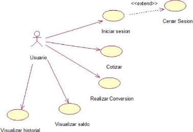

Diagrama de clases

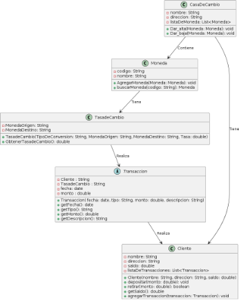

Paquete

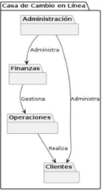

Diagrama de Despliegue

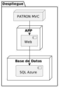

Diagrama de Arquitectura

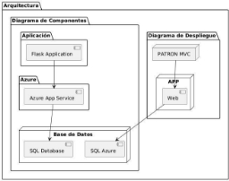

1. # **Desarrollo de la propuesta**
   1. ## **Tecnología de información**

1. ## **Metodología, técnicas usadas**
   **Metodologías de análisis:**

   **Sonarcloud**

SonarCloud es una plataforma de análisis de código que permite a los desarrolladores mejorar la calidad y la seguridad de sus proyectos de software, incluyendo aquellos construidos sobre .NET Framework. Al proporcionar análisis en tiempo real, SonarCloud ayuda a identificar problemas de calidad del código, vulnerabilidades de seguridad y deudas técnicas. Con su integración en flujos de trabajo de CI/CD, SonarCloud permite a los equipos recibir retroalimentación continua sobre su código, lo que facilita la identificación temprana de errores y la implementación de mejores prácticas de programación. Además, SonarCloud ofrece un panel de control intuitivo y visualizaciones claras que permiten a los desarrolladores monitorear el progreso de la calidad del código a lo largo del tiempo, asegurando que las aplicaciones no solo sean funcionales, sino también mantenibles y seguras.

Workflow

Para la creación del nuevo flujo de trabajo se creó el archivo sonar.yml. Para ello, se consideró la siguiente estructura

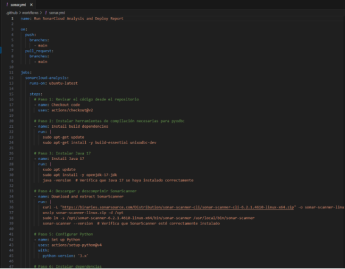

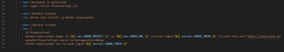

Este workflow de GitHub Actions está diseñado para realizar un análisis de calidad de código utilizando SonarCloud en  A continuación se presenta un resumen de las tareas que ejecuta:

Definición de Variables de Entorno: Se establecen variables como la versión de .NET, la organización en SonarCloud y el ID del proyecto.

Activación del Workflow: Se ejecuta automáticamente cuando hay un push a la rama main.

Análisis de Sonarqube:

- Revisar el código: Usar actions/checkout@v2 para obtener el código del repositorio.
- Instalar dependencias necesarias: Instalar herramientas como build-essential y unixodbc-dev para pyodbc.
- Instalar Java 17: Instalar Java 17 usando openjdk-17-jdk y verificar la instalación.
- Descargar y configurar SonarScanner: Descargar, extraer y configurar SonarScanner para realizar análisis en SonarCloud.
- Configurar Python: Establecer la versión de Python usando actions/setup-python@v4.
- Instalar dependencias del proyecto: Usar pip para instalar las dependencias definidas en requirements.txt.
- Ejecutar pruebas con cobertura: Ejecutar pruebas con pytest y generar reportes de cobertura en formato XML y HTML.
- Ejecutar análisis en SonarCloud: Usar SonarScanner para analizar el código y enviar resultados a SonarCloud.
- Verificar existencia de directorio htmlcov: Comprobar que el reporte HTML de cobertura se ha generado correctamente.
- Crear y mover los reportes: Crear una carpeta de reportes y mover el directorio htmlcov generado a esta carpeta.
- Eliminar .gitignore de htmlcov: Eliminar cualquier archivo .gitignore que pueda estar presente en htmlcov.
- Configurar Git para GitHub Pages: Configurar usuario y correo electrónico para realizar cambios en la rama gh-pages.
- Guardar cambios en Git: Agregar y confirmar los cambios locales antes de realizar un checkout.
- Publicar reportes en GitHub Pages: Cambiar a la rama gh-pages, copiar el directorio htmlcov y publicar el reporte de cobertura.

Resultado de análisis

Para revisar el análisis que se revisó desde github actions, nos dirigimos a la plataforma de sonarcloud y nos autenticamos. Luego, nos dirigimos a la sección de “Organizations” para ingresar a nuestra organización personal el cual está vinculada con nuestro proyecto e ingresamos.

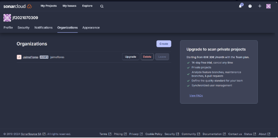

Una vez dentro de la plataforma, visualizaremos que tenemos dos análisis de dos proyectos, pero en este caso ingresaremos a nuestro proyecto softvet. Previamente, nos da algunos resultados en porcentajes o por puntos según las categorías existentes. 

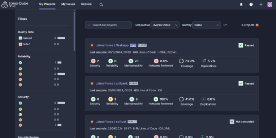

Al haber ingresado, notaremos que nos muestra a más detalle los indicadores del análisis realizado en nuestro proyecto, como que en rentabilidad solo tenemos 2 puntos, en mantenibilidad 181 y en el área de duplicación tendremos 2%, lo cual son aspectos que debemos corregir a futuro para tener un mejor resultado. Respecto al porcentaje de cobertura, notamos que esta un 0.0%, esto es porque cómo es un proyecto de escritorio en .NET Framework, con el que se gestiona el registro de pacientes y la generación de reportes para una clínica veterinaria, no se mantiene registro de pruebas realizadas dentro del proyecto, dado que este tipo de aplicaciones tiene el enfoque específico y limitado en sus funcionalidades. 

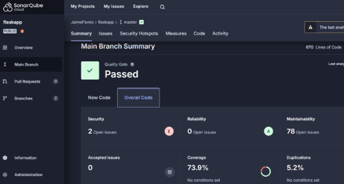

**Snyk**

Snyk es una herramienta de análisis de seguridad diseñada para identificar y remediar vulnerabilidades en las dependencias de proyectos, incluida la plataforma .NET Framework. Al integrarse en el ciclo de vida del desarrollo de software, Snyk permite a los desarrolladores detectar de manera proactiva problemas de seguridad en sus bibliotecas y componentes de terceros. A través de análisis automatizados, Snyk proporciona informes detallados sobre vulnerabilidades conocidas y sugiere soluciones efectivas, ayudando a los equipos a mantener la seguridad de sus aplicaciones y a cumplir con las mejores prácticas de desarrollo seguro. Su capacidad para integrarse con flujos de trabajo existentes, como CI/CD, lo convierte en una opción valiosa para proyectos .NET Framework que buscan mejorar su postura de seguridad sin interrumpir el proceso de desarrollo.

Workflow:

Para la creación del nuevo flujo de trabajo se creó el archivo snyk.yml. Para ello, se consideró la siguiente estructura

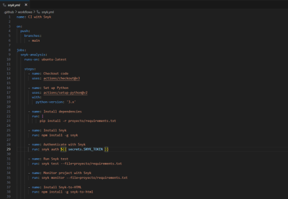

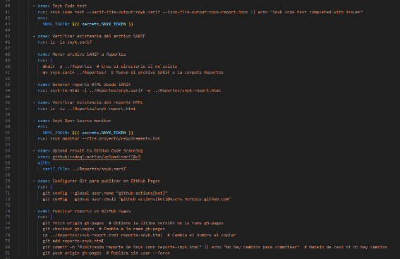

Este workflow de GitHub Actions, llamado "Snyk Security", tiene como objetivo realizar un análisis de seguridad en un proyecto cada vez que se realiza un push a la rama main. Entre las tareas que realiza este workflow están:

Activación del workflow: Se activa automáticamente al hacer un push en la rama main.

Configuración de permisos: Se establecen permisos para leer el contenido y escribir eventos de seguridad.

Definición del entorno de ejecución: El job snyk se ejecuta en un entorno Ubuntu.

Checkout del repositorio: Se utiliza la acción actions/checkout para clonar el repositorio en el entorno de ejecución.

Configuración de .NET: Se configura la versión de .NET requerida (en este caso, la versión 8.x) utilizando la acción actions/setup-dotnet.

Configuración de Snyk CLI: Se configura la interfaz de línea de comandos (CLI) de Snyk para permitir el análisis del proyecto.

Autenticación con Snyk: Se autentica en Snyk utilizando un token de acceso almacenado en los secretos del repositorio (SNYK\_TOKEN).

Cambio al directorio del proyecto: Se cambia al directorio del proyecto (ProyectoFinal) para realizar los análisis.

Análisis de código con Snyk: Se ejecuta el comando snyk code test, que realiza un análisis de seguridad del código y genera un informe en formato SARIF (snyk-code.sarif).

Monitoreo de código abierto con Snyk: Se utiliza el comando snyk monitor para monitorear las dependencias de código abierto del proyecto en busca de vulnerabilidades.

Carga de resultados a GitHub Code Scanning: Se suben los resultados del análisis a GitHub utilizando la acción github/codeql-action/upload-sarif, lo que permite a los desarrolladores ver los problemas de seguridad directamente en la interfaz de GitHub.

Resultado

Para revisar el análisis que se revisó desde github actions, nos dirigimos a la plataforma de snyk y nos autenticamos. Luego, nos dirigimos a la sección de Projects para visualizar nuestro repositorio.

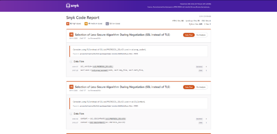

Dando a entender que, Snyk no ha encontrado vulnerabilidades críticas, altas, medias o bajas. Por lo que, cómo es un proyecto de escritorio en .NET Framework, con el que se gestiona el registro de pacientes y la generación de reportes para una clínica veterinaria, no se muestra problemas en Snyk, dado que este tipo de aplicaciones tiene el enfoque específico y limitado en sus funcionalidades. 

**Semgrep**

Semgrep es una herramienta de análisis estático de código que permite a los desarrolladores identificar vulnerabilidades de seguridad y problemas de calidad en múltiples lenguajes de programación mediante la búsqueda de patrones de código. Su integración sencilla en flujos de trabajo de CI/CD y su capacidad para generar informes detallados hacen que sea una opción efectiva para mejorar la seguridad y la calidad del software en tiempo real. Además, su enfoque flexible permite a los usuarios crear y personalizar sus propios patrones, adaptándose a las necesidades específicas de sus proyectos.

Workflow

Para la creación del nuevo flujo de trabajo se creó el archivo semgrep.yml. Para ello, se consideró la siguiente estructura

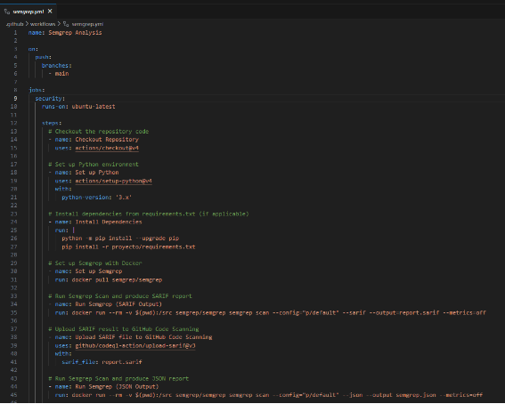

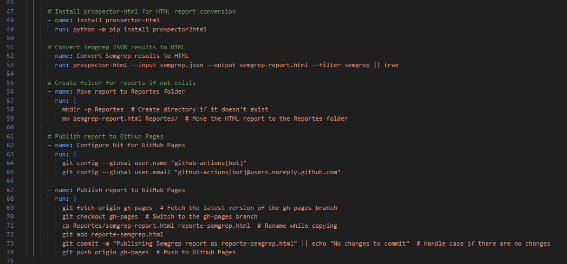

Este workflow de GitHub Actions llamado Semgrep Analysis se ejecuta en la rama main al realizar un push. A continuación, se detallan las tareas que se llevan a cabo:

Checkout Repository: Se clona el repositorio en el entorno de ejecución.

Setup .NET Framework: Se configura el entorno de .NET Framework si es necesario (se incluye un mensaje de ejemplo).

Semgrep Scan: Se ejecuta un análisis de código utilizando Semgrep, con una configuración predeterminada (p/default), generando un informe en formato SARIF (report.sarif).

Upload Result to GitHub Code Scanning: Se sube el informe SARIF generado al sistema de análisis de código de GitHub para su visualización y revisión.

Resultado de análisis

En este caso, hemos generado el análisis y lo hemos subido a code scanning el cual se encuentra dentro de nuestro repositorio de github. Nos aparecerán los siguientes resultados:

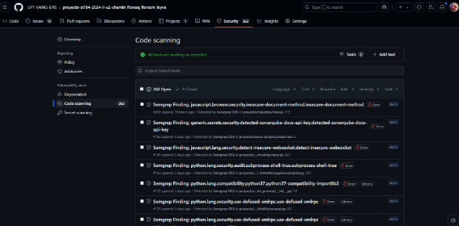

El análisis de seguridad realizado mediante GitHub Code Scanning y Semgrep ha identificado varias vulnerabilidades en el código del proyecto. Se han detectado múltiples incidencias relacionadas con la exposición de tokens JWT, específicamente en los archivos RegistrarEmpleado.cs y RegistrarCliente.cs. Además, se ha encontrado una vulnerabilidad SSRF en ApisPeru.cs, lo que podría permitir ataques de tipo Server-Side Request Forgery. Por último, también se ha identificado la exposición de claves de API de SonarQube en la configuración correspondiente. Es fundamental abordar estos hallazgos para mejorar la seguridad general de la aplicación.

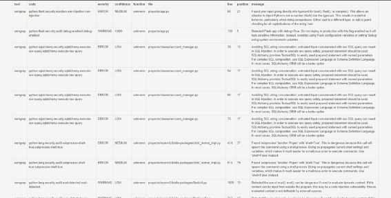

Release

Un **release** es una versión específica de un software que se marca para distribución. Generalmente incluye una combinación de nuevas características, correcciones de errores y mejoras. En GitHub, un release se asocia a un **tag** (como v1.0.0) y puede contener binarios o artefactos compilados listos para descarga, junto con una descripción de los cambios realizados en esa versión.

Workflow

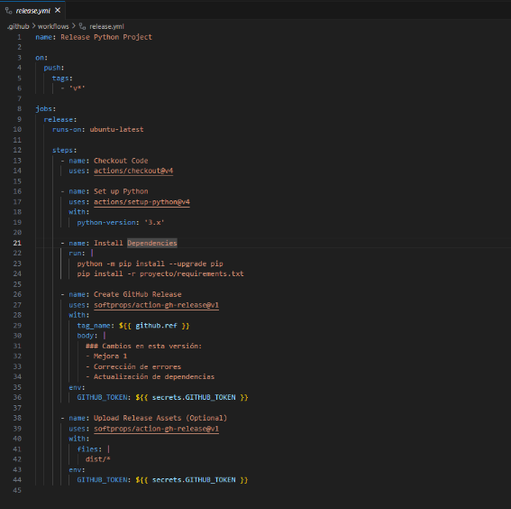

Este bloque de código representa un **job** llamado release dentro del workflow de GitHub Actions, que se encarga de crear una nueva versión del proyecto, o **release**, en GitHub. Este job tiene las siguientes características:

- **release:**: Define el trabajo que realizará la tarea de release.
- **needs: nuget-package**: Indica que este job depende de que el job nuget-package haya finalizado exitosamente. Es decir, el release solo se ejecutará si el paquete NuGet ya ha sido creado y publicado correctamente.
- **runs-on: ubuntu-latest**: Especifica que este job se ejecutará en un entorno con el sistema operativo **Ubuntu**, en su versión más reciente.

Pasos dentro del job release:

- **Checkout del código**:
  1. El paso **Checkout Code** utiliza la acción actions/checkout@v4 para descargar el código fuente del repositorio en la máquina virtual de GitHub Actions. Esto es necesario porque el release se basa en el código actual del proyecto.
- **Crear el release en GitHub**:
  1. El paso **Create GitHub Release** utiliza la acción softprops/action-gh-release@v1 para crear un **release** en GitHub.
  1. **tag\_name: ${{ github.ref }}**: Se utiliza la referencia de Git que activó el workflow (almacenada en ${{ github.ref }}), generalmente un tag de versión (como v1.0.0), para asociar el release a ese tag en GitHub.
  1. **body:**: Aquí se define el cuerpo del release, que describe los cambios realizados en esta versión. En este caso, se mencionan mejoras, correcciones de errores y actualizaciones de dependencias, aunque estos detalles pueden personalizarse según los cambios reales de cada versión.
- **Autenticación**:
  1. En el bloque **env:**, se pasa el token secreto GITHUB\_TOKEN a través de la variable de entorno, lo que autoriza el proceso de creación del release. Este token es automáticamente proporcionado por GitHub para permitir que los workflows realicen acciones seguras, como la creación de un release en el repositorio.

Resultado

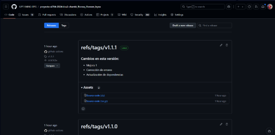

El resultado de la ejecución del código demuestra la creación automatizada de **releases** mediante el uso de tags cuyo nombre comienza con "v". Esto garantiza que, cada vez que se realice un **push** en el proyecto acompañado de un tag que cumpla con las condiciones definidas en el workflow, se activará el proceso, generando un nuevo **release** asociado a la versión indicada por el tag. Además, se utilizará la descripción predeterminada establecida en el workflow para ese release.

Este enfoque automatiza el proceso de publicación de nuevas versiones, asegurando que cualquier nueva versión del proyecto (identificada por un tag) sea lanzada automáticamente como un **release** en GitHub, simplificando la gestión de versiones y liberaciones.

**Herramientas de Pruebas**

**Pruebas Unitarias e integración**

Las pruebas unitarias son una práctica común en el desarrollo de software, donde los desarrolladores crean casos de prueba junto con el código, lo que facilita la identificación y corrección temprana de errores. Con el uso de marcos de automatización como JUnit, es posible ejecutar de manera frecuente y automática conjuntos completos de pruebas unitarias, lo que optimiza el proceso de validación del software (Daka & Fraser, 2014). Esta metodología no solo permite encontrar defectos en etapas tempranas del desarrollo, sino que también contribuye a reducir significativamente la cantidad de problemas en las nuevas funcionalidades y en los cambios realizados sobre la funcionalidad existente. De esta manera, las pruebas unitarias ayudan a garantizar que el código se mantenga robusto y confiable a lo largo del ciclo de vida del software (Hunt, 2019).

Además de las pruebas unitarias, otro enfoque importante para garantizar la calidad del software son las pruebas de integración. Estas pruebas consisten en evaluar un sistema mediante la integración progresiva de subcomponentes previamente verificados para asegurar su correcto funcionamiento. La integración de estos subcomponentes en el sistema global puede dar lugar a comportamientos emergentes que requieren ser verificados de manera exhaustiva (Kandl & Elshuber, 2014). Por lo tanto, tanto las pruebas unitarias como las de integración son esenciales para detectar errores y asegurar que el sistema funcione correctamente cuando los distintos componentes interactúan entre sí.

**Archivos de Pruebas:**

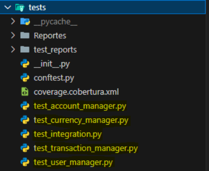

**Automatización:**

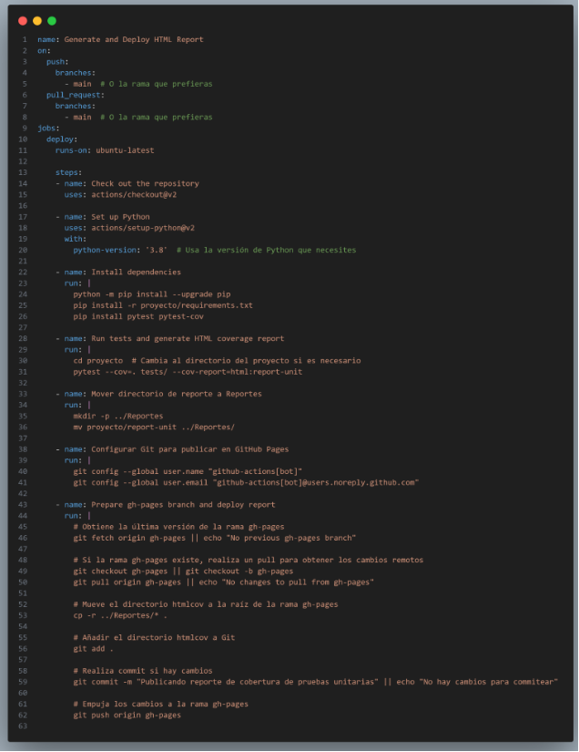

**Análisis del Reporte:**

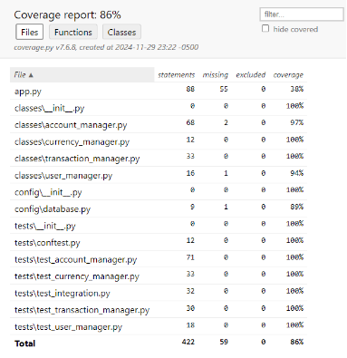

El reporte de cobertura de pruebas unitarias muestra que, en general, el nivel de cobertura es del 86%. Este es un porcentaje relativamente alto, lo que indica que una gran parte del código está siendo probada de manera efectiva. Sin embargo, también hay áreas en las que es posible mejorar la cobertura de pruebas para alcanzar un nivel más cercano al 100%, lo cual sería ideal para garantizar que la mayoría del código esté suficientemente validado.

Por otro lado, varios archivos de código, especialmente dentro de las carpetas classes y tests, tienen una cobertura de 100%, como currency\_manager.py, transaction\_manager.py, user\_manager.py, y muchos archivos dentro de tests. Estos resultados son muy positivos y muestran que estas áreas del código están siendo exhaustivamente cubiertas por las pruebas, lo que reduce considerablemente el riesgo de errores en estas partes del sistema.

En archivos como config\database.py, la cobertura es del 89%, lo que también indica una buena cobertura de pruebas, aunque aún queda un pequeño margen de mejora para alcanzar una cobertura completa. Esto no es tan crítico como el caso de app.py, pero sigue siendo un área donde podría agregarse un pequeño conjunto de pruebas adicionales para mejorar la cobertura.

**Pruebas BDD**

**Concepto:**

Las pruebas Behavior-Driven Development (BDD) son un enfoque de desarrollo ágil que describe el comportamiento esperado de un sistema desde la perspectiva del usuario final, utilizando un lenguaje accesible y estructurado basado en el formato Given-When-Then (Dado-Cuando-Entonces). Este enfoque fomenta la colaboración entre desarrolladores, testers y partes interesadas no técnicas para garantizar que los requisitos del cliente se traduzcan en pruebas automatizadas y código funcional. Herramientas como Behave permiten implementar BDD en Python, facilitando la creación y ejecución de pruebas que validan características específicas del sistema.

**Archivos de Pruebas:**

La estructura del proyecto BDD se divide en dos directorios: Features, que contiene los archivos .feature con los escenarios de prueba (como account\_manager.feature), y steps, donde se encuentran los archivos \*\_steps.py (como account\_manager\_steps.py) que implementan la lógica de los pasos definidos en los escenarios. Ambos directorios incluyen archivos \_\_init\_\_.py para ser reconocidos como módulos Python, facilitando la organización y ejecución de las pruebas.

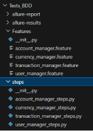

**Automatización:**

Para llevar a cabo la automatización se creó el workflow bdd.yml, el cual consta del siguiente contenido:

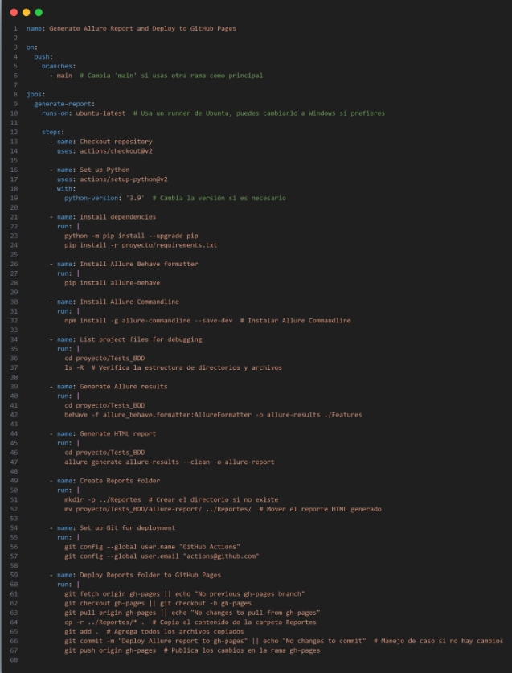

El workflow presentado automatiza la ejecución de pruebas BDD con Behave y la generación de reportes visuales mediante Allure. Los pasos incluyen:

1. Configurar el entorno con dependencias de Python y herramientas como Allure Behave y Allure Commandline.
1. Ejecutar las pruebas BDD en el directorio de características (*Features*), capturando los resultados en un formato compatible con Allure.
1. Generar un reporte HTML detallado con estadísticas de las pruebas y moverlo a un directorio destinado a reportes.
1. Desplegar el reporte generado en una rama de GitHub Pages (*gh-pages*), permitiendo que los resultados sean accesibles públicamente a través de una URL.

Este pipeline no solo garantiza que las pruebas se ejecuten consistentemente, sino que también proporciona una visualización clara de los resultados para los miembros del equipo y partes interesadas.

**Análisis del Reporte:**

El reporte refleja resultados impecables: 4 features pasaron, 0 fallaron y 15 escenarios pasaron exitosamente. A nivel granular, los 45 pasos ejecutados también pasaron sin fallas ni definiciones faltantes, lo que indica pruebas robustas y completas. Estas métricas no solo muestran la estabilidad del sistema, sino también que los casos cubren adecuadamente las funcionalidades esperadas.

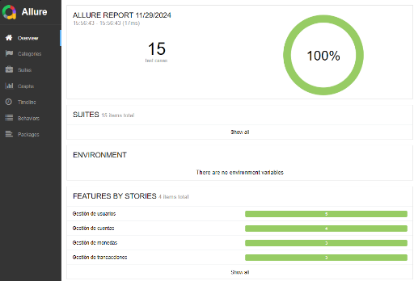

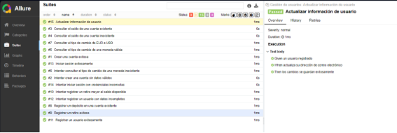

Entre las pruebas destacadas, se incluyen acciones críticas como "Actualizar información de usuario" (#15), completada en 1ms, y verificaciones de negocio como "Consultar el saldo de una cuenta inexistente" (#4), que fue manejada correctamente en 0s. Además, operaciones clave como la creación exitosa de cuentas (#1) y transacciones como depósitos (#8) y retiros (#9) fueron verificadas con tiempos mínimos, reflejando eficiencia y estabilidad en la implementación. Este resultado sugiere que el sistema cumple tanto con los requisitos funcionales como con criterios de rendimiento.

**Pruebas Mutantes**

**Concepto:**

Las pruebas mutantes son una técnica avanzada de análisis para evaluar la calidad de las pruebas unitarias. Esta técnica introduce cambios (mutaciones) en el código fuente de manera controlada y luego ejecuta las pruebas unitarias para determinar si son capaces de detectar estos cambios.

El objetivo principal es medir la eficacia de las pruebas unitarias, asegurándose de que cubren adecuadamente los casos más importantes del código y pueden detectar errores introducidos intencionalmente.

¿Cómo funciona?

- Mutación del código: Se generan versiones mutadas de tu código original. Por ejemplo, cambiar un operador lógico (== por !=) o modificar valores constantes.
- Ejecución de pruebas unitarias: Se ejecutan las pruebas contra el código mutado.
- Resultado:

  Mutantes asesinados: Las pruebas detectaron el cambio.

  Mutantes sobrevivientes: Las pruebas no detectaron el cambio, lo que indica áreas de mejora en las pruebas unitarias.

**Archivos de Pruebas:**

Estructura del Proyecto

El proyecto contiene las siguientes carpetas relevantes para las pruebas:

- classes/: Contiene las clases principales del proyecto (e.g., user\_manager.py, account\_manager.py).
- tests/: Contiene las pruebas unitarias diseñadas para verificar el comportamiento de las clases.

|**Archivo**|**Descripción**|
| :- | :- |
|tests/test\_currency\_manager.py|Contiene pruebas unitarias relacionadas con la gestión de divisas|
|tests/test\_user\_manager.py|Pruebas para verificar funcionalidades de gestión de usuarios.|
|tests/test\_account\_manager.py|Valida las operaciones relacionadas con cuentas de usuario.|
|tests/test\_transaction\_manager.py|Pruebas para funcionalidades de transacciones.|
|tests/test\_integration.py|Casos de prueba de integración entre varios componentes.|
|tests/conftest.py|Configuración de fixtures compartidas para los casos de prueba.|

**Automatización:**

El proceso de pruebas mutantes está completamente automatizado mediante un workflow definido en un archivo YAML. A continuación, se describe cada paso.

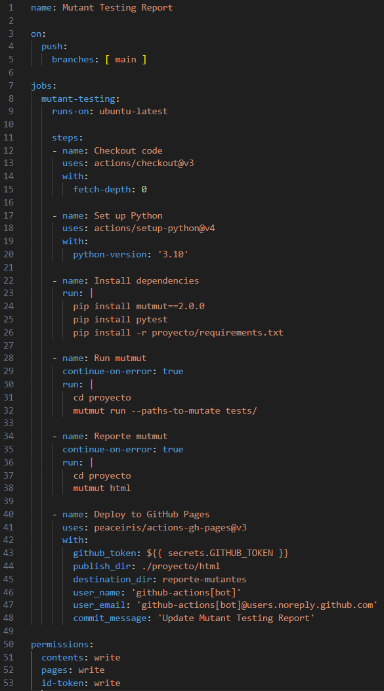

- Configuración de Python:

  Se instala Python 3.10.

  Se instalan las dependencias necesarias (e.g., mutmut, pytest).

- Ejecución de pruebas mutantes:

  Se apunta a la carpeta tests/ para generar mutaciones y ejecutar las pruebas unitarias correspondientes.

- Generación del Reporte HTML:

  Utiliza mutmut html para generar un reporte visual con el análisis de mutaciones.

- Despliegue en GitHub Pages:

Publica el reporte en la rama gh-pages bajo el directorio reporte-mutantes.

**Análisis del Reporte:**

|**Métrica**|**Resultado**|
| :- | :- |
|Total de Mutantes Generados|326|
|Mutantes Asesinados|250|
|Mutantes Sobrevivientes|76|
|Eficiencia de Asesinato (%)|76\.69 %|

De un total de 326 mutantes generados, se logró "asesinar" (es decir, detectar) 250, lo que representa un 76.69% de efectividad. Esto indica que las pruebas unitarias en el proyecto tienen una buena cobertura general y son capaces de identificar una mayoría significativa de errores introducidos mediante mutaciones. Sin embargo, la existencia de 76 mutantes sobrevivientes señala áreas donde las pruebas pueden mejorarse para detectar cambios específicos en el código.

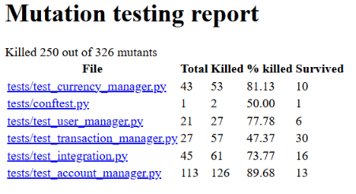

- Archivo con mayor cobertura (tests/test\_account\_manager.py):

  Eficiencia del 89.68%. Esto sugiere que las pruebas unitarias en este archivo son robustas y detectan la mayoría de las mutaciones.

- Archivo con menor cobertura (tests/test\_transaction\_manager.py):

  Eficiencia del 47.37%. Se recomienda revisar los casos de prueba para mejorar la detección de mutaciones.

**Pruebas de Interfaz de Usuario**

Las pruebas de interfaz de usuario (UI) permiten evaluar una aplicación tal como la verían los usuarios, verificando la corrección a través de señales visuales y eventos interactivos que simulan usos del mundo real. Estas pruebas son esenciales para identificar defectos de regresión y mejorar la experiencia del usuario, asegurando que la aplicación no solo funcione correctamente, sino que también sea intuitiva y fácil de usar (Mishra, 2017). Las pruebas de UI no solo se centran en la funcionalidad, sino que también prestan atención a la apariencia y a la interacción, aspectos cruciales para la aceptación por parte de los usuarios finales.

Además, las pruebas de UI contribuyen significativamente a la mejora de la calidad del software. Permiten detectar y corregir discrepancias en la interfaz, como posiciones, tamaños y colores inconsistentes de los objetos, lo que mejora la calidad general del software. Al corregir estos defectos visuales, se puede garantizar una experiencia de usuario más coherente y atractiva, lo que aumenta la satisfacción del usuario final.

Herramientas avanzadas como TOLLER también han mejorado la cobertura de código y la detección de fallos en aplicaciones móviles, como las de Android. Estas herramientas permiten realizar pruebas más exhaustivas, detectando fallos que podrían pasar desapercibidos en un entorno de pruebas manuales. El uso de estas herramientas contribuye a una mayor robustez del software, al asegurar que la interfaz y la funcionalidad estén correctamente implementadas y que el sistema sea más fiable en situaciones del mundo real (Wang, Lam, & Xie, 2021).

**Archivos de Pruebas:**

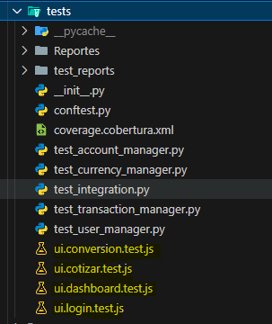

**Automatización:**

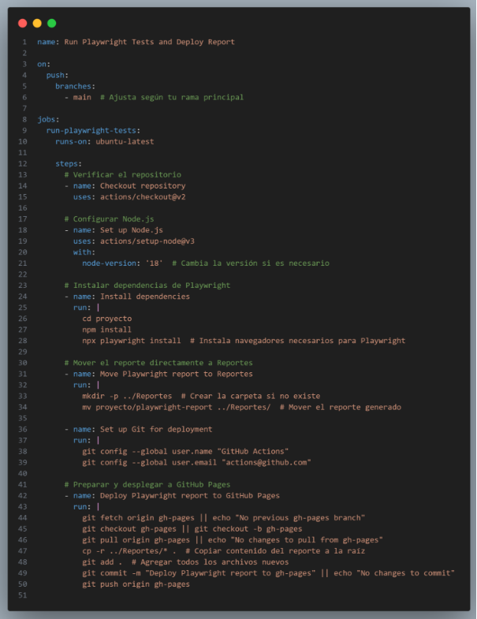

**Análisis del Reporte:**

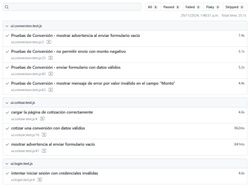
### **Análisis de Pruebas**
Se realizaron un total de 8 pruebas a la aplicación, obteniendo los siguientes resultados:

**Pruebas de Conversión**:

1. Mostrar advertencia al enviar formulario vacío: Aprobada (5.4s)
1. No permitir envío con monto negativo: Aprobada (7.1s)
1. Mostrar mensaje de error por valor nulo en el campo "Monto": Aprobada (5.2s)

**Pruebas de Cotización**:

1. Cargar la página de cotización correctamente: Aprobada (4.6s)
1. Cotizar una conversión con datos válidos: Aprobada (962ms)

**Pruebas de Inicio de Sesión**:

1. Intentar iniciar sesión con credenciales inválidas: Aprobada (4.6s)

Todas las pruebas fueron aprobadas, lo que indica que las funcionalidades evaluadas están operando correctamente.
1. # **Cronograma**
Cronograma para Análisis de Errores con SonarQube:

Fase 1: Configuración y Recolección de Datos

Duración: 1 semana

Personas Involucradas:

Líder de Proyecto

Desarrolladores (2)

Analista de Calidad

Actividades:

Configuración de SonarQube para el análisis completo del proyecto.

Revisión de la configuración de reglas de calidad y estándares de codificación en SonarQube.

Configuración de GitHub Actions para ejecutar automáticamente el análisis de SonarQube en cada push a la rama principal.

Ejecución de un análisis completo del código.

Recursos:

Acceso a SonarQube.

Repositorio de GitHub con configuración de Actions.

Fase 2: Análisis de Resultados

Duración: 2 semanas

Personas Involucradas:

Líder de Proyecto

Desarrolladores (2)

Analista de Calidad

Actividades:

Revisión detallada de los informes generados por SonarQube.

Clasificación de errores según su tipo (deuda técnica, vulnerabilidades, errores críticos, etc.).

Identificación de tendencias en los errores (por ejemplo, clases o módulos más afectados).

Recursos:

Acceso a SonarQube.
1. # **Conclusión**
La implementación de metodologías de análisis en proyectos de desarrollo de software, como el que se ha llevado a cabo en "softvet", es una práctica cada vez más esencial en un entorno tecnológico en constante evolución. A medida que las aplicaciones se vuelven más complejas y las expectativas de los usuarios crecen, la necesidad de garantizar la calidad, seguridad y sostenibilidad del software se convierte en una prioridad.

Integrar herramientas de análisis como SonarCloud, Snyk y Semgrep no solo permite a los desarrolladores tener una visión clara del estado del código, sino que también promueve una cultura de mejora continua. Estas herramientas son fundamentales para identificar de manera proactiva vulnerabilidades de seguridad, problemas de mantenibilidad y deuda técnica, antes de que estos se conviertan en obstáculos significativos para el desarrollo. Al implementar análisis de calidad en tiempo real, los equipos pueden recibir retroalimentación inmediata, lo que les permite realizar ajustes y correcciones en etapas tempranas del ciclo de desarrollo.

La seguridad del software es un aspecto crucial en el que las metodologías de análisis juegan un papel vital. En un mundo donde la exposición de datos sensibles puede tener consecuencias devastadoras, asegurar que las aplicaciones sean robustas ante ataques y vulnerabilidades es imperativo. Herramientas como Snyk permiten la identificación y remediación de vulnerabilidades en las dependencias y el código, lo que no solo protege la información de los usuarios, sino que también ayuda a cumplir con normativas de seguridad y buenas prácticas en el desarrollo.

Además, el proceso de capacitación del equipo de desarrollo es fundamental para el éxito de estas metodologías. La educación y el entrenamiento en el uso de herramientas de análisis aseguran que todos los miembros del equipo estén alineados en cuanto a las mejores prácticas y la importancia de la calidad del código. La creación de documentación técnica clara y accesible también facilita la adopción de nuevas herramientas y metodologías, asegurando que el equipo esté preparado para enfrentar desafíos y aprovechar al máximo las oportunidades que surjan.

El establecimiento de un ciclo de revisión y mejora continua es igualmente importante. A medida que se implementan nuevas prácticas y herramientas, es vital evaluar periódicamente su eficacia y adaptarse a las necesidades cambiantes del proyecto y del mercado. Este enfoque ágil no solo garantiza que el software se mantenga relevante, sino que también contribuye a una mejor experiencia del usuario final, lo que se traduce en un mayor grado de satisfacción y lealtad hacia la aplicación.

**10. Referencias bibliográficas**

Daka, E., & Fraser, G. (2014). A survey on unit testing practices and problems. *2014 IEEE 25th International Symposium on Software Reliability Engineering*, 201-211.<https://doi.org/10.1109/ISSRE.2014.11>

Hunt, N. (2019). Unit testing. *J. Object Oriented Program.*, 8, 18-23.<https://doi.org/10.1007/978-1-4302-3802-7_14>

Kandl, S., & Elshuber, M. (2014). A formal approach to system integration testing. *ArXiv*, abs/1404.6743.

Mishra, A. (2017). Testing the User Interface. En *Mejora de la Calidad del Software* (pp. 407-432).<https://doi.org/10.1007/978-1-4842-2689-6_13>

Wang, W., Lam, W., & Xie, T. (2021). An infrastructure approach to improving effectiveness of Android UI testing tools. *Proceedings of the 30th ACM SIGSOFT International Symposium on Software Testing and Analysis*.<https://doi.org/10.1145/3460319.3464828>

